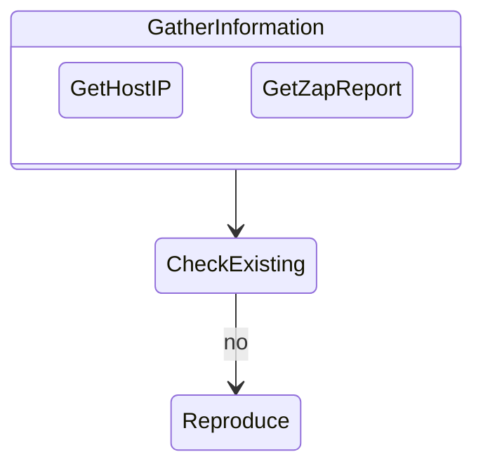
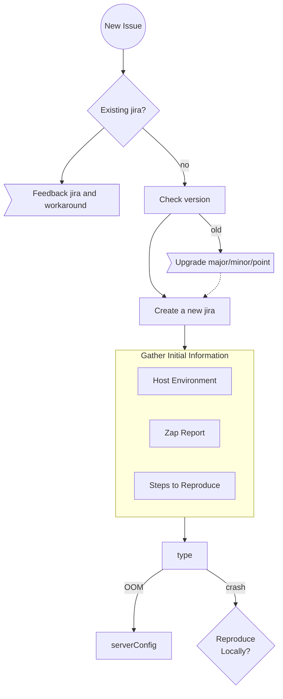
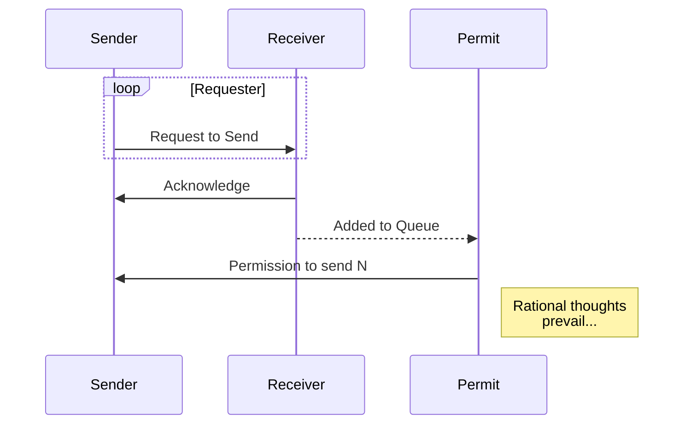

https://mermaid.js.org/syntax/flowchart.html

Using a state diagram

Using a flowchart:

Sequence diagrams could be good for working through designs and documenting .  Adapt to document the udp layer.

